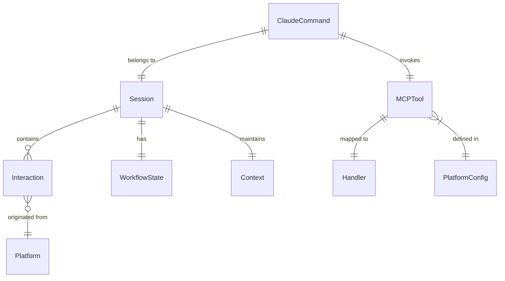

# Data Model: Claude CLI Integration

## Core Entities

### Session (Extended)
```json
{
  "session_id": "uuid-v4",
  "platform": "claude|gemini",        // NEW: Track originating platform
  "platform_metadata": {              // NEW: Platform-specific data
    "claude": {
      "conversation_id": "string",
      "user_id": "string"
    }
  },
  "created_at": "2025-01-11T10:00:00Z",
  "updated_at": "2025-01-11T10:15:00Z",
  "expires_at": "2025-01-12T10:00:00Z",
  "current_stage": "problem_definition",
  "workflow_state": {
    "step": 1,
    "total_steps": 6,
    "completed_steps": []
  },
  "context": {
    "problem_description": "string",
    "ideal_final_result": "string",
    "contradictions": [],
    "selected_principles": [],
    "generated_solutions": []
  },
  "interactions": [
    {
      "timestamp": "2025-01-11T10:00:00Z",
      "platform": "claude",
      "command": "/triz-workflow",
      "input": "string",
      "response": "string"
    }
  ]
}
```

### MCPTool (New)
```json
{
  "name": "triz-workflow",
  "description": "Start guided TRIZ problem-solving workflow",
  "platform": "claude",
  "parameters": [],
  "examples": ["/triz-workflow"],
  "handler": "handle_workflow_start",
  "requires_session": true,
  "timeout_seconds": 30
}
```

### ClaudeCommand (New)
```json
{
  "raw_command": "/triz-solve reduce weight while maintaining strength",
  "parsed": {
    "command": "triz-solve",
    "action": "solve",
    "parameters": {
      "problem": "reduce weight while maintaining strength"
    }
  },
  "timestamp": "2025-01-11T10:00:00Z",
  "session_id": "uuid-v4"
}
```

### PlatformConfig (New)
```json
{
  "platform": "claude",
  "mcp_server": {
    "name": "triz-copilot",
    "version": "1.0.0",
    "port": null,  // Unix socket for Claude
    "protocol": "mcp"
  },
  "commands": {
    "prefix": "/triz",
    "available": ["workflow", "solve", "tool"]
  },
  "features": {
    "async_support": true,
    "streaming": false,
    "file_access": true
  }
}
```

## Relationships



## State Transitions

### Workflow States
```
START → PROBLEM_DEFINITION → FUNCTION_ANALYSIS → PARAMETER_MAPPING 
→ PRINCIPLE_IDENTIFICATION → SOLUTION_GENERATION → EVALUATION → COMPLETE
```

### Session Lifecycle
```
CREATED → ACTIVE → IDLE → RESUMED → COMPLETED/EXPIRED
```

## Data Storage

### File System Layout
```
~/.triz/
├── sessions/
│   ├── active/
│   │   └── {session_id}.json
│   ├── completed/
│   │   └── {date}/
│   │       └── {session_id}.json
│   └── metadata.json
├── config/
│   ├── claude.json
│   └── gemini.json
└── logs/
    ├── claude/
    └── gemini/
```

### Session Metadata Index
```json
{
  "active_sessions": {
    "uuid-1": {
      "platform": "claude",
      "created_at": "2025-01-11T10:00:00Z",
      "last_active": "2025-01-11T10:15:00Z"
    },
    "uuid-2": {
      "platform": "gemini",
      "created_at": "2025-01-11T09:00:00Z",
      "last_active": "2025-01-11T09:45:00Z"
    }
  },
  "stats": {
    "total_sessions": 145,
    "claude_sessions": 45,
    "gemini_sessions": 100,
    "cross_platform_sessions": 12
  }
}
```