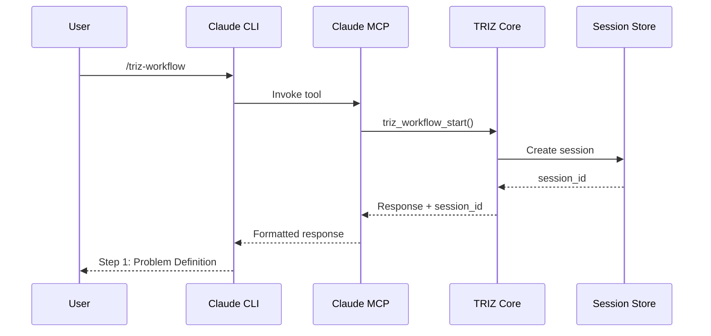

# Implementation Plan: Claude CLI Integration for TRIZ Co-Pilot

**Feature Branch**: `002-add-claude-cli`  
**Created**: 2025-01-11  
**Spec**: [spec.md](./spec.md)

## 🎯 Implementation Overview

Add Claude CLI support to the existing TRIZ Co-Pilot system by creating a Claude-specific MCP server that mirrors the Gemini MCP server functionality, while sharing the core TRIZ library, session management, and knowledge base components.

## 🏗️ Technical Architecture

### System Architecture
```
┌─────────────────────────────────────────────────────────┐
│                     Claude CLI                          │
│                  (claude.ai/code)                       │
└────────────────────┬────────────────────────────────────┘
                     │ MCP Protocol
┌────────────────────▼────────────────────────────────────┐
│              Claude MCP Server                          │
│          (src/claude_mcp_server.py)                     │
├──────────────────────────────────────────────────────────┤
│                  Tool Registry                          │
│    ┌──────────────┬──────────────┬──────────────┐     │
│    │  Workflow    │    Solve     │    Direct    │     │
│    │   Tools      │    Tools     │    Tools     │     │
│    └──────────────┴──────────────┴──────────────┘     │
└────────────────────┬────────────────────────────────────┘
                     │
┌────────────────────▼────────────────────────────────────┐
│              Shared TRIZ Core Library                   │
│                (src/triz_tools/)                        │
├──────────────────────────────────────────────────────────┤
│  • Session Manager  • Knowledge Base  • Vector Service  │
│  • Workflow Tools   • Solve Tools     • Direct Tools    │
│  • Validation       • Logging         • Health Checks   │
└──────────────────────────────────────────────────────────┘
                     │
     ┌───────────────┼───────────────┬────────────────┐
     ▼               ▼               ▼                ▼
┌─────────┐   ┌─────────┐   ┌─────────┐      ┌─────────┐
│ Session │   │ Qdrant  │   │ Ollama  │      │ Gemini  │
│  Store  │   │   DB    │   │Embeddings│     │   MCP   │
└─────────┘   └─────────┘   └─────────┘      └─────────┘
```

### Component Interaction Flow


## 🛠️ Technology Stack

**Language/Version**: Python 3.11+ (same as existing codebase)  
**Primary Dependencies**: 
- `anthropic-mcp` - Claude MCP server framework
- Existing: `qdrant-client`, `ollama`, `pydantic`, `structlog`

**Testing**: pytest with async support for MCP handlers  
**Storage**: Shared JSON session files in `~/.triz/sessions/`  
**Project Type**: Library extension with CLI integration

## 📦 Implementation Details

### 1. Claude MCP Server Setup

**File**: `src/claude_mcp_server.py`

```python
from anthropic_mcp import MCPServer, Tool, ToolResponse
from triz_tools import workflow_tools, solve_tools, direct_tools

class ClaudeTRIZServer:
    def __init__(self):
        self.server = MCPServer("triz-copilot")
        self._register_tools()
    
    def _register_tools(self):
        # Workflow tools
        self.server.register_tool(
            Tool(
                name="triz-workflow",
                description="Start guided TRIZ workflow",
                handler=self._handle_workflow_start
            )
        )
        # Additional tool registrations...
```

**Key Implementation Points**:
- Use anthropic-mcp package for Claude integration
- Create wrapper functions that translate between MCP and TRIZ core
- Handle async/await patterns required by MCP protocol
- Implement proper error handling and response formatting

### 2. Tool Registration Mapping

**File**: `src/claude_tools/__init__.py`

Create three modules mapping to TRIZ modes:

```python
# Workflow Commands
/triz-workflow → workflow_start()
/triz-workflow continue → workflow_continue(session_id, input)

# Solve Commands  
/triz-solve [problem] → solve_autonomous(problem)

# Direct Tool Commands
/triz-tool get-principle [n] → get_principle(n)
/triz-tool contradiction-matrix → get_contradiction(improving, worsening)
/triz-tool brainstorm → brainstorm_principle(principle, context)
```

### 3. Session Management Integration

**File**: `src/triz_tools/session_manager.py` (extend existing)

```python
class SessionManager:
    def create_session(self, platform="claude"):
        # Add platform field to track origin
        session = {
            "session_id": str(uuid.uuid4()),
            "platform": platform,  # New field
            "created_at": datetime.utcnow(),
            "interactions": []
        }
```

**Session Storage Structure**:
```
~/.triz/sessions/
├── active/
│   └── {session_id}.json
├── completed/
│   └── {session_id}.json
└── metadata.json
```

### 4. Command Parser Enhancement

**File**: `src/claude_tools/parser.py`

```python
class ClaudeCommandParser:
    PATTERNS = {
        'workflow_start': r'^/triz-workflow$',
        'workflow_continue': r'^/triz-workflow continue (.+)$',
        'solve': r'^/triz-solve (.+)$',
        'get_principle': r'^/triz-tool get-principle (\d+)$',
        'contradiction': r'^/triz-tool contradiction-matrix --improving (\d+) --worsening (\d+)$',
        'brainstorm': r'^/triz-tool brainstorm --principle (\d+) --context "(.+)"$'
    }
```

### 5. Response Formatter

**File**: `src/claude_tools/formatter.py`

```python
class ClaudeResponseFormatter:
    @staticmethod
    def format_workflow_response(triz_response):
        # Convert TRIZToolResponse to Claude-friendly markdown
        return f"""
## TRIZ Workflow - {triz_response.stage}

{triz_response.message}

**Session ID**: `{triz_response.session_id}`
**Next Step**: {triz_response.data.get('next_action')}
        """
```

### 6. Configuration Management

**File**: `src/config/claude_config.json`

```json
{
  "mcp": {
    "server_name": "triz-copilot",
    "version": "1.0.0",
    "commands": {
      "triz-workflow": {
        "description": "Start guided TRIZ problem-solving workflow",
        "examples": ["/triz-workflow"]
      },
      "triz-solve": {
        "description": "Autonomous TRIZ analysis",
        "examples": ["/triz-solve reduce weight while maintaining strength"]
      },
      "triz-tool": {
        "description": "Access specific TRIZ tools",
        "examples": [
          "/triz-tool get-principle 15",
          "/triz-tool contradiction-matrix --improving 2 --worsening 14"
        ]
      }
    }
  },
  "shared": {
    "session_timeout_hours": 24,
    "max_session_size_mb": 10,
    "vector_db_url": "http://localhost:6333",
    "ollama_url": "http://localhost:11434"
  }
}
```

### 7. Installation & Setup Script

**File**: `scripts/setup-claude.sh`

```bash
#!/usr/bin/env bash
# Setup Claude CLI integration for TRIZ Co-Pilot

echo "Setting up Claude CLI integration..."

# Install Claude MCP dependencies
uv add anthropic-mcp

# Create Claude configuration directory
mkdir -p ~/.claude/mcp

# Generate Claude MCP manifest
cat > ~/.claude/mcp/triz-copilot.json << EOF
{
  "name": "triz-copilot",
  "version": "1.0.0",
  "description": "TRIZ Engineering Co-Pilot for Claude",
  "server": {
    "command": "python",
    "args": ["${PWD}/src/claude_mcp_server.py"],
    "env": {
      "PYTHONPATH": "${PWD}/src"
    }
  }
}
EOF

echo "✅ Claude CLI integration configured"
```

## 🧪 Testing Strategy

### Unit Tests
- `tests/unit/test_claude_parser.py` - Command parsing
- `tests/unit/test_claude_formatter.py` - Response formatting
- `tests/unit/test_claude_tools.py` - Tool wrapper functions

### Integration Tests
- `tests/integration/test_claude_mcp_server.py` - MCP server functionality
- `tests/integration/test_cross_platform_sessions.py` - Session sharing
- `tests/integration/test_claude_workflow.py` - End-to-end workflow

### Contract Tests
- `tests/contract/test_claude_contract.py` - MCP protocol compliance
- Ensure identical behavior between Claude and Gemini implementations

### Performance Tests
- `tests/performance/test_claude_response_times.py`
- Verify <10 second full analysis, <500ms lookups

## 🚀 Deployment Steps

1. **Install Dependencies**
   ```bash
   uv sync
   uv add anthropic-mcp
   ```

2. **Configure Claude CLI**
   ```bash
   ./scripts/setup-claude.sh
   ```

3. **Register with Claude**
   ```bash
   claude mcp install ./claude-mcp-manifest.json
   ```

4. **Verify Installation**
   ```bash
   claude mcp list  # Should show triz-copilot
   ```

5. **Test Commands**
   ```bash
   claude chat
   > /triz-workflow
   > /triz-tool get-principle 1
   ```

## 📁 File Structure Changes

```
src/
├── claude_mcp_server.py        # NEW: Main Claude MCP server
├── claude_tools/                # NEW: Claude-specific tools
│   ├── __init__.py
│   ├── parser.py               # Command parsing
│   ├── formatter.py            # Response formatting
│   └── handlers.py             # Tool handlers
├── config/
│   ├── claude_config.json      # NEW: Claude configuration
│   └── gemini_config.json      # Existing
└── triz_tools/                  # EXISTING: Shared core
    ├── session_manager.py       # MODIFIED: Add platform field
    └── ...

tests/
├── contract/
│   ├── test_claude_contract.py # NEW
│   └── test_gemini_contract.py # Existing
├── integration/
│   ├── test_claude_mcp_server.py # NEW
│   └── test_cross_platform_sessions.py # NEW
└── ...

scripts/
├── setup-claude.sh              # NEW: Claude setup script
└── setup-gemini.sh              # Existing

~/.claude/
└── mcp/
    └── triz-copilot.json       # NEW: MCP manifest
```

## ⚠️ Risk Mitigation

### Technical Risks

1. **MCP Protocol Changes**
   - Risk: Claude MCP API might change
   - Mitigation: Version lock anthropic-mcp, implement adapter pattern

2. **Session Compatibility**
   - Risk: Session format differences between platforms
   - Mitigation: Use platform-agnostic JSON schema with version field

3. **Performance Degradation**
   - Risk: Adding Claude support slows down Gemini
   - Mitigation: Lazy loading, separate process for each MCP server

### Implementation Risks

1. **Command Conflicts**
   - Risk: Claude commands might conflict with existing Claude tools
   - Mitigation: Use unique prefix (/triz-*) for all commands

2. **Async Handling**
   - Risk: MCP requires async, TRIZ core is sync
   - Mitigation: Use asyncio.run() for sync-to-async bridge

## 📊 Success Metrics

- [ ] All 3 TRIZ commands available in Claude CLI
- [ ] Response time <10s for full analysis
- [ ] Session sharing works between Claude and Gemini
- [ ] 100% test coverage for new Claude code
- [ ] Zero regression in Gemini functionality
- [ ] Documentation complete for both platforms

## 🔄 Implementation Phases

### Phase 1: Core Integration (Week 1)
- Set up Claude MCP server structure
- Implement basic tool registration
- Create command parser and response formatter

### Phase 2: Tool Implementation (Week 1-2)
- Implement all three TRIZ modes
- Integrate with existing TRIZ core library
- Add session management platform field

### Phase 3: Testing & Polish (Week 2)
- Write comprehensive tests
- Performance optimization
- Documentation and setup scripts

### Phase 4: Validation (Week 2-3)
- User acceptance testing
- Cross-platform session testing
- Performance benchmarking

## 📝 Notes

- Leverage existing TRIZ core library without modifications
- Maintain backward compatibility with Gemini CLI
- Use same knowledge base and vector DB
- Follow existing code patterns and conventions
- Document differences between Claude and Gemini behaviors