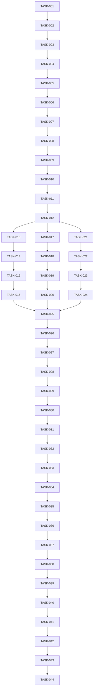

# Tasks: Claude CLI Integration for TRIZ Co-Pilot

**Feature Branch**: `002-add-claude-cli`  
**Plan**: [plan.md](./plan.md)  
**Total Tasks**: 44
**Estimated Duration**: 2-3 weeks

## Phase 1: Core Integration Setup (12 tasks)

### MCP Server Foundation
- [ ] **TASK-001**: Install anthropic-mcp package and dependencies
  - Add to pyproject.toml optional dependencies
  - Run `uv add anthropic-mcp jsonrpc-asyncio aiofiles`
  - Verify installation with import test
  
- [ ] **TASK-002**: Create basic Claude MCP server structure
  - Create `src/claude_mcp_server.py`
  - Implement MCPServer class with initialization
  - Add JSON-RPC request handler skeleton
  
- [ ] **TASK-003**: Implement MCP protocol handlers
  - Add `tools/list` method handler
  - Add `tools/call` method handler  
  - Add error handling for invalid methods
  
- [ ] **TASK-004**: Create Claude configuration file
  - Create `src/config/claude_config.json`
  - Define tool configurations
  - Set timeout and session parameters

### Tool Registration System
- [ ] **TASK-005**: Create tool registry module
  - Create `src/claude_tools/__init__.py`
  - Define tool registration decorator
  - Implement tool discovery mechanism
  
- [ ] **TASK-006**: Implement command parser
  - Create `src/claude_tools/parser.py`
  - Add regex patterns for all commands
  - Implement parse_command function with validation
  
- [ ] **TASK-007**: Create response formatter
  - Create `src/claude_tools/formatter.py`
  - Add format methods for each tool type
  - Implement markdown formatting utilities

### MCP Manifest & Setup
- [ ] **TASK-008**: Generate Claude MCP manifest
  - Create manifest template
  - Add tool definitions from schema
  - Validate against MCP specification
  
- [ ] **TASK-009**: Create setup script for Claude
  - Create `scripts/setup-claude.sh`
  - Add manifest installation logic
  - Include environment configuration
  
- [ ] **TASK-010**: Implement health check endpoint
  - Add health check tool to MCP server
  - Return version and status information
  - Include dependency checks

### Async/Sync Bridge
- [ ] **TASK-011**: Create async wrapper utilities
  - Implement sync-to-async bridge functions
  - Add asyncio.to_thread for CPU-bound operations
  - Handle async context properly
  
- [ ] **TASK-012**: Add logging for Claude MCP
  - Configure structured logging for Claude
  - Add debug mode for development
  - Implement request/response logging

## Phase 2: Tool Implementation (16 tasks)

### Workflow Tool Implementation
- [ ] **TASK-013**: Implement workflow start handler
  - Create `src/claude_tools/workflow_handler.py`
  - Implement start_workflow function
  - Return proper session ID and initial stage
  
- [ ] **TASK-014**: Implement workflow continue handler
  - Add continue_workflow function
  - Validate session ID format
  - Handle stage progression logic
  
- [ ] **TASK-015**: Add workflow state management
  - Track current step in workflow
  - Implement stage transition validation
  - Add completion detection
  
- [ ] **TASK-016**: Create workflow response templates
  - Define markdown templates for each stage
  - Add progress indicators
  - Include next action hints

### Solve Tool Implementation
- [ ] **TASK-017**: Implement autonomous solve handler
  - Create `src/claude_tools/solve_handler.py`
  - Add problem parsing logic
  - Implement full TRIZ analysis flow
  
- [ ] **TASK-018**: Add contradiction identification
  - Extract technical contradictions
  - Identify physical contradictions
  - Format contradiction output
  
- [ ] **TASK-019**: Implement principle recommendation
  - Query vector database for relevant principles
  - Rank principles by relevance
  - Return top 3-5 principles
  
- [ ] **TASK-020**: Generate solution concepts
  - Create solution generation logic
  - Apply principles to problem context
  - Format solutions with pros/cons

### Direct Tool Implementation
- [ ] **TASK-021**: Implement get-principle handler
  - Create `src/claude_tools/direct_handler.py`
  - Add principle lookup by number
  - Return full principle details with examples
  
- [ ] **TASK-022**: Implement contradiction matrix handler
  - Add matrix lookup logic
  - Validate parameter ranges (1-39)
  - Return recommended principles
  
- [ ] **TASK-023**: Implement brainstorm handler
  - Add contextual idea generation
  - Apply specific principle to context
  - Generate at least 3 ideas
  
- [ ] **TASK-024**: Add parameter validation
  - Validate all input parameters
  - Return helpful error messages
  - Handle edge cases gracefully

### Session Management Integration
- [ ] **TASK-025**: Extend session manager for Claude
  - Add platform field to session model
  - Update `src/triz_tools/session_manager.py`
  - Maintain backward compatibility
  
- [ ] **TASK-026**: Implement session persistence
  - Save sessions to ~/.triz/sessions/
  - Add atomic file operations
  - Implement session locking
  
- [ ] **TASK-027**: Add session expiration handling
  - Implement TTL checking
  - Clean up expired sessions
  - Add session renewal logic
  
- [ ] **TASK-028**: Create session migration utilities
  - Add platform metadata handling
  - Ensure cross-platform compatibility
  - Test session format consistency

## Phase 3: Testing & Integration (10 tasks)

### Unit Testing
- [ ] **TASK-029**: Write parser unit tests
  - Create `tests/unit/test_claude_parser.py`
  - Test all command patterns
  - Verify error handling
  
- [ ] **TASK-030**: Write formatter unit tests
  - Create `tests/unit/test_claude_formatter.py`
  - Test markdown generation
  - Verify response structure
  
- [ ] **TASK-031**: Write handler unit tests
  - Test workflow handler functions
  - Test solve handler logic
  - Test direct tool handlers

### Integration Testing
- [ ] **TASK-032**: Create MCP server integration tests
  - Create `tests/integration/test_claude_mcp_server.py`
  - Test full request/response cycle
  - Verify async behavior
  
- [ ] **TASK-033**: Test cross-platform sessions
  - Create `tests/integration/test_cross_platform_sessions.py`
  - Start session in Claude, continue in Gemini
  - Verify data consistency
  
- [ ] **TASK-034**: Test end-to-end workflows
  - Create `tests/integration/test_claude_workflow_e2e.py`
  - Test complete workflow from start to finish
  - Verify all stage transitions

### Contract Testing
- [ ] **TASK-035**: Implement contract test fixtures
  - Create mock MCP server implementation
  - Add test data fixtures
  - Setup test environment
  
- [ ] **TASK-036**: Make contract tests pass
  - Implement functionality to pass contract tests
  - Verify all contracts are satisfied
  - Document any deviations

### Performance Testing
- [ ] **TASK-037**: Create performance benchmarks
  - Create `tests/performance/test_claude_performance.py`
  - Measure response times for each tool
  - Verify <10s for full analysis
  
- [ ] **TASK-038**: Optimize slow operations
  - Profile code for bottlenecks
  - Add caching where appropriate
  - Optimize vector searches

## Phase 4: Documentation & Deployment (6 tasks)

### Documentation
- [ ] **TASK-039**: Update main README
  - Add Claude CLI section
  - Update installation instructions
  - Add platform comparison table
  
- [ ] **TASK-040**: Create Claude-specific documentation
  - Create `docs/claude-cli-guide.md`
  - Add troubleshooting section
  - Include examples for each command
  
- [ ] **TASK-041**: Update API documentation
  - Document Claude MCP API
  - Add response format examples
  - Include error code reference

### Deployment & Validation
- [ ] **TASK-042**: Create deployment checklist
  - List all deployment steps
  - Add rollback procedures
  - Include verification tests
  
- [ ] **TASK-043**: Perform user acceptance testing
  - Test with real users
  - Gather feedback
  - Document issues and fixes
  
- [ ] **TASK-044**: Final integration verification
  - Verify no regression in Gemini
  - Test all Claude commands
  - Confirm cross-platform compatibility

## Task Dependencies

## Execution Strategy

### Week 1: Foundation
- Complete Phase 1 (Tasks 1-12)
- Start Phase 2 Workflow implementation (Tasks 13-16)
- Daily progress check-ins

### Week 2: Implementation
- Complete Phase 2 (Tasks 17-28)
- Start Phase 3 Testing (Tasks 29-34)
- Begin integration testing

### Week 3: Polish & Deploy
- Complete Phase 3 (Tasks 35-38)
- Complete Phase 4 (Tasks 39-44)
- User acceptance testing
- Final deployment

## Success Criteria

- [ ] All 44 tasks completed
- [ ] All contract tests passing
- [ ] Performance benchmarks met
- [ ] Documentation complete
- [ ] User acceptance achieved
- [ ] Zero regression in Gemini

## Risk Tracking

| Risk | Mitigation | Status |
|------|------------|--------|
| MCP protocol changes | Version lock, abstraction layer | Monitoring |
| Async complexity | Thorough testing, simple bridge | Planned |
| Session compatibility | Platform-agnostic format | Designed |
| Performance issues | Profiling, caching | Ready |

## Notes

- Start with TASK-001 and follow dependencies
- Each task should have tests before marking complete
- Update this document as tasks are completed
- Create branches for major task groups if needed
- Regular commits with task numbers in messages